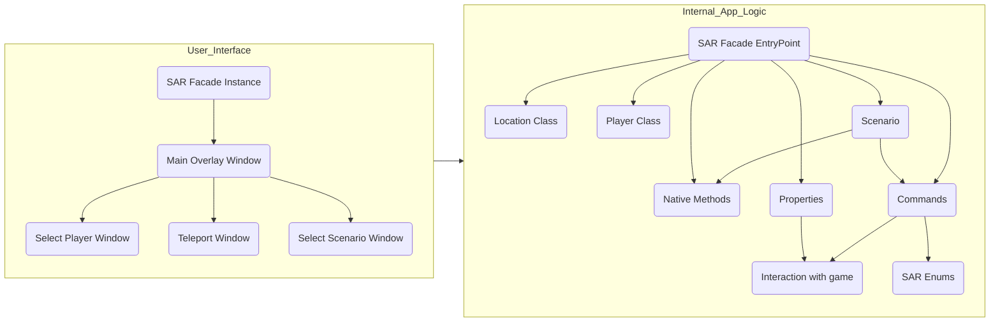

# SAR-PM-Overlay

This project is a game overlay for [Super Animal Royale](https://animalroyale.com/) provides UI for moders/private match hosters.

It displays bar in the bottom of the screen with buttons. When you click on them, tool set focus on game window and input commands via chat simulating user input.

# Screenshot

# Instalation and running

- Install .NET 5.0 for Desktop
- Download latest release from this repository
- Open the game
- Run that application
- Start private match
- Enjoy!

## Usage

I hope interface is friendly for user and don't need an explanation. 

The only non-obvious thing is that right-clicking on the [Kill] [God] [Ghost] buttons applies the command to itself, and for the [Spawn] button - executes the same command that was called the last time when selecting item.

## Features

The list of features available in that overlay:
- Match ID - *prints current match's ID*
- Night - *switchs the night*
- Gas - *turn on/off the gas*
- Soccer - *creates a soccer ball*
- Teleport - *teleports you or another player to selected location, which can be choosen from list or on the map*
- Start match - *starts match with or without bots*
- Scenarious - *executes described queue of actions*
- Kill - *kills the player or self if click with right mouse button*
- Kick - *kicks the player*
- God - *Enables/disables the god mode for the player or self if click with right mouse button*
- Ghost - *Enables/disables the ghost mode for the player or self if click with right mouse button*
- Flight - *Change flight direction*
- One hits - *one-hits mode*

## Structure of the project

## About Scenarios

Scenario is a queue of actions save in file .sarpms (SAR Private Match Scenario)
Syntax:
- Char # in the begining of the line - comment, line will be ignored
- Empty lines are also ignores
- Other lines interprets as **actions**
- Action contains **type** and **parameters** divided with tabulation symbol
- Types and parameters:
  - D - Delay
    - Parameter is a number of seconds or * for wait for pressing [Continue] button
  - C - Chat or command
    - Parameter is just a string which will be entered in game chat
  - P - Press a key
    - Parameter is a key
  - T - Title of scenario
  - S - Start the match
    - Parameter + turn on bots
- You can use templates in actions
- Available templates:
  - <ALL> - action will be applied for all players
  - <ME> - for current user
  - <AEM> - All Exclude Me - for all players exclude current
  - <T0> - No Team, <T1> and <T2> - Team 1 and Team 2

## People

### Author of the project
Quantum0 (aka Eat Me OwO in the game)

### Thankies to
- Mango - Access to Private Matches
- Ket_domashniy - Discussing idea, icon
- Woo - Template of scenario for duel, testing
- Naxifir - Discussing idea
- My friends in SAR - Testing
- Pixile - Thankies for that game!
- SAR wiki - Information about commands and their description, map image

*Materials from [SAR Wiki](https://animalroyale.fandom.com/) is under [CC BY-NC-SA 3.0 license](https://creativecommons.org/licenses/by-nc-sa/3.0/)*
